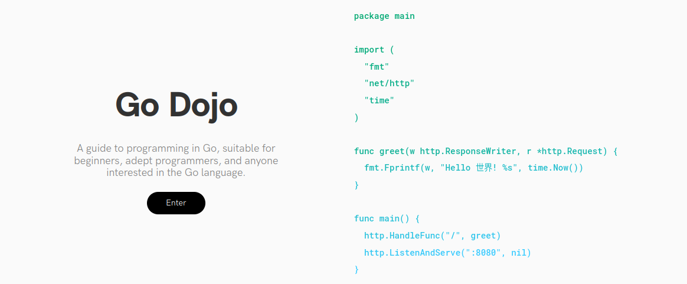

# 👨‍💻 Go Dojo

Go Dojo is a project from 2019, that guides the user through an exploration of the Go language.

## Overview

- Introduction
  - The history of Go
  - What is Go?
  - History
  - Design
  - Syntax
  - Go Tools
  - Go Commands
  - Why Go?
- Go Setup
  - Prerequisites
  - Installing Go
  - Setting Go Paths
  - Constructing a suitable workspace
  - Hello World
- Go Basics
  - Development Environment
  - Packages
  - Imports
  - Variables
  - Functions
  - Operators
  - If statements
  - Switch cases
  - Loops
  - Arrays
  - Slices
  - Maps
- Go Advanced
  - Defer
  - Structs
  - Methods
  - Public and Private
  - Interfaces
  - Goroutines
  - Channels
  - File I/O
  - The end
